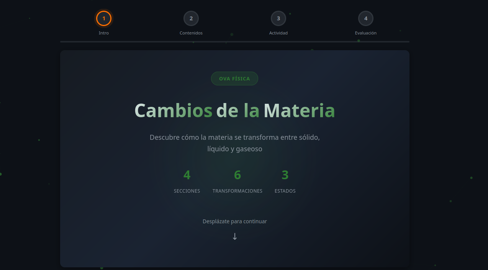
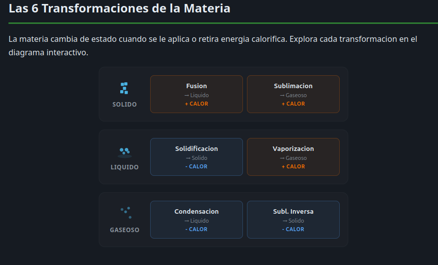
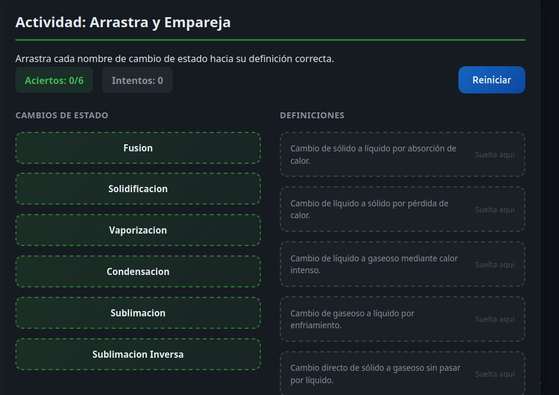
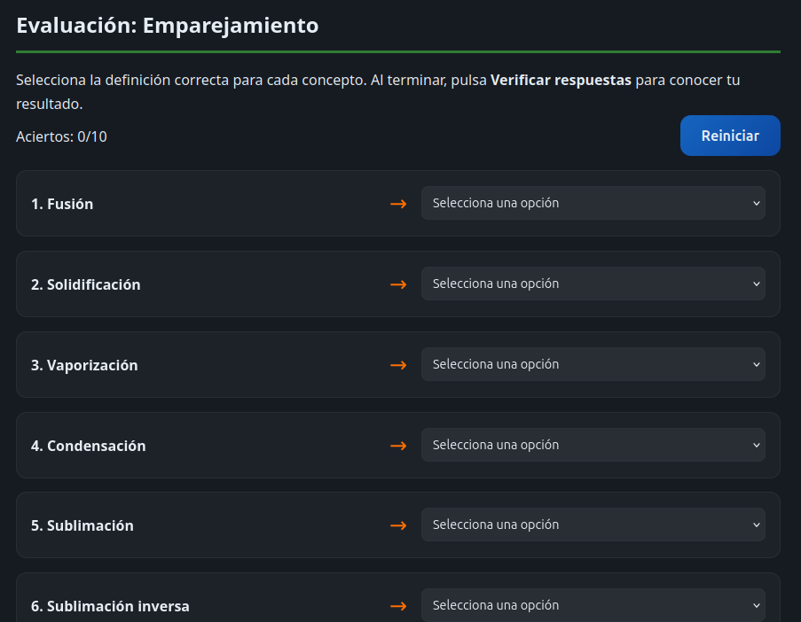

# OVA Física - Cambios de la Materia

Objeto Virtual de Aprendizaje (OVA) interactivo sobre los cambios de estado de la materia, diseñado para el programa de Análisis y Desarrollo de Software.

## Tema

Cambios de la materia: estados y transformaciones.

## Estructura del OVA

### Paso 1: Introducción y Objetivos

Explica qué son los cambios de estado de la materia y por qué ocurren (energía, temperatura y presión). Incluye título, justificación, competencias a desarrollar, encuesta de diagnóstico y checklist de verificación.

### Paso 2: Contenidos Multimediales

Infografía interactiva con los seis cambios de estado (fusión, solidificación, vaporización, condensación, sublimación y sublimación inversa), cada uno con su ejemplo cotidiano, más un simulador de partículas controlado por temperatura.

### Paso 3: Actividades de Aprendizaje

Actividad de arrastrar y soltar donde el estudiante empareja cada nombre de cambio de estado con su definición correcta. Incluye contador de aciertos e intentos y funciona con mouse y pantalla táctil.

### Paso 4: Evaluación

- Cuestionario de emparejamiento de 10 ítems.
- Cuestionario de 10 preguntas de verdadero o falso.
- Retroalimentación inmediata que explica el porqué de cada respuesta.

## Tecnologías

- Vue 3
- Vue Router 4
- Vite
- GSAP (animaciones)
- Canvas 2D (partículas)
- CSS3 con variables y responsive

## Requisitos

- Node.js (v18+)
- npm (v9+)

## Instalación

```bash
npm install
```

## Desarrollo

```bash
npm run dev
```

Abrir `http://localhost:5173`.

## Construcción para producción

```bash
npm run build
npm run preview
```

## Estructura de carpetas

```
src/
├── components/
│   ├── ParticleBackground.vue    - Fondo con partículas animadas
│   ├── ParticleSimulator.vue     - Simulador de partículas por temperatura
│   └── ProgressBar.vue           - Barra de progreso de los 4 pasos
├── views/
│   ├── Paso1View.vue             - Introducción y Objetivos
│   ├── Paso2View.vue             - Contenidos multimediales
│   ├── Paso3View.vue             - Actividad de arrastrar y soltar
│   └── Paso4View.vue             - Evaluación
├── router/
│   └── index.js                  - Configuración de Vue Router
├── styles/
│   └── variables.css             - Variables CSS globales
├── App.vue                       - Layout raíz
└── main.js                       - Punto de entrada
```

## Capturas









## Enlaces

- Aplicación en Vercel: https://ova-cambios-materia.vercel.app
- Repositorio GitHub: https://github.com/martinz10one/ova-cambios-materia.git

## Autor

OVA Física - Programa de Análisis y Desarrollo de Software.
